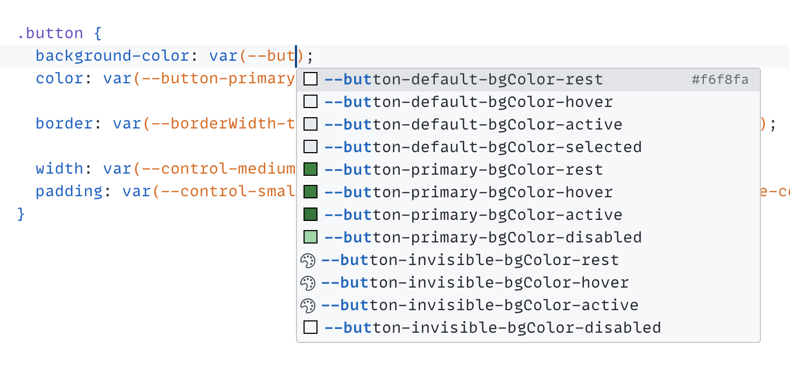
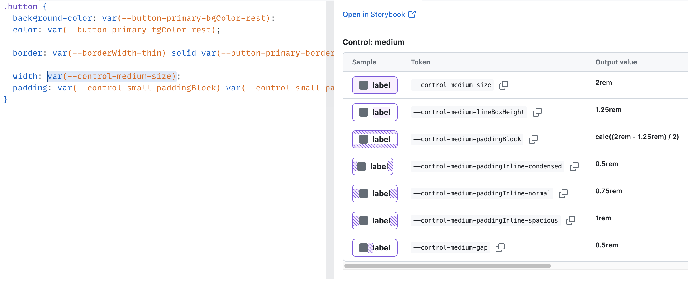

  
    
  <b>VSCode extension for primer/primitives</b>
    
  

&nbsp;

### Demo

[📹 Watch on Loom](https://www.loom.com/share/850deb30cbb1426fb308615b886163f9?sid=9f5db9b5-a386-4a57-ac95-240dc03ba7db) (3m 44s)

&nbsp;

Heavily inspired by [vscode-css-variables](https://github.com/vunguyentuan/vscode-css-variables) by [Vu Nguyen](https://github.com/vunguyentuan)
